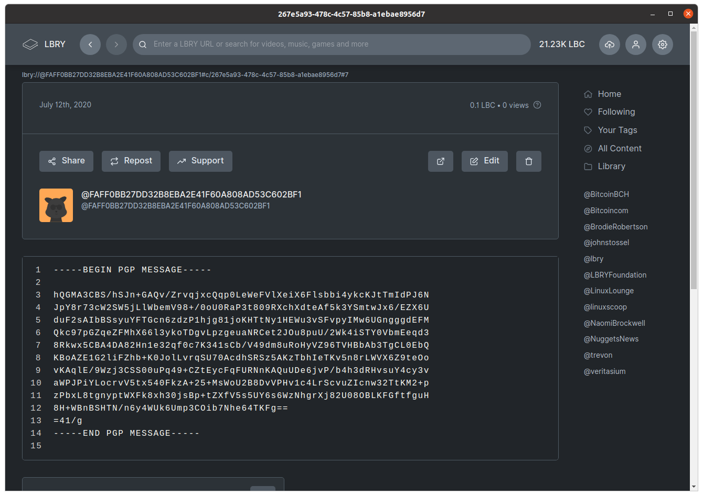

# Project

This project is a Python Flask API for a simple social media app using lbry.io to persist data and PGP/GPG to encrypt.

## Requirements

- pipenv
- python3
- virtualenv
- python3-psycopg2

Install pipenv ([official instructions](https://pipenv.pypa.io/en/latest/install/#installing-pipenv))

```bash
brew install pipenv
# Sets config to create the venv in the project directory rather than mapping it globally
echo 'export PIPENV_VENV_IN_PROJECT=1' >> ~/.profile

# Install psycopg2 if not already available
sudo apt-get install build-dep python3-psycopg2
```

Linux

```bash
pip install pipenv
```

## Create a pipenv

```bash
pipenv shell
```

## Process

In this example, I will be running as `lucas@bitcoinbrisbane.com.au` PubKey `FAFF0BB27DD32B8EBA2E41F60A808AD53C602BF1` and posting to a friend `lucas@dltx.io` PubKey `31C3DF951686F51D882C74570D2934925D219FFA`

1. Create your PGP pair (if you dont have one)
2. Upload to a key server.  We use keys.openpgp.org
3. Create content json object
4. Encrypt the json object with your friends PubKey
5. Create a lbry channel with the claim id as your PubKey.  Eg ``
6. Upload the encrypted json object to lbry.io

A lbry.io channel is created with your PGP/GPG pub key finger print

### Content Schema

```json
{
    "friends": [
        "lucas@dltx.io"
    ],
    "content": {
        "type": "text",
        "title": "First time",
        "body": "Hi, this is my first post!"
    }
}
```



## Notes and thanks

https://gnupg.readthedocs.io/en/latest/
